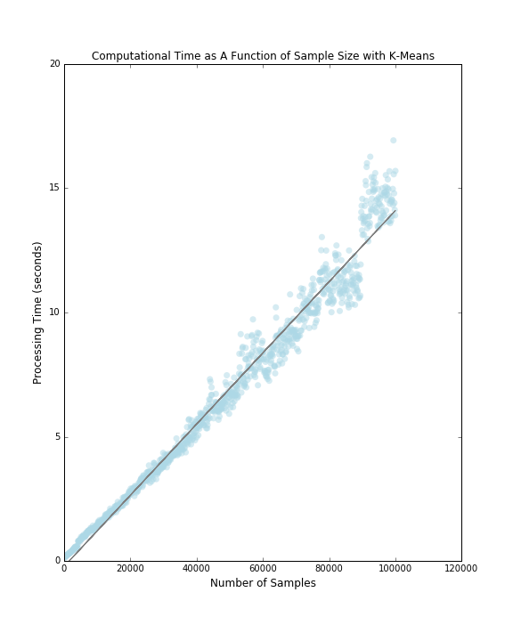

## Assignment 1

### Part 1. Clustering: the baseline

#### Prepare data
Original data set is 1 million. The following code is used to extract 100K from the total sample. 

```python
with open('data/tweets_1M.json','r') as f:
    tweets = json.load(f)

X = np.array([[tweets[x]['lat'],tweets[x]['lng']] for x in range(0, len(tweets))])
sample = 100000
total = len(X)
X = X[0::int(total/sample)]
```

#### Reference time of clustering of 100K samples into k=100 clusters with k-means 

```python
n = 100
k_means = KMeans(init='k-means++', n_clusters=n, n_init=10)
t_km = time.time()
k_means.fit(X)
t_fin_km = time.time() - t_km
print (t_fin_km)
```

Reference time is 141 seconds

#### Reference time of clustering of 100K samples into k=100 clusters with mini-batch k-means.
To select a propropriate batch_size, the following code is used to roughly look at the relationship between `batch size` 
and processing time.

```python
def frange(start, stop, step):
    i = start
    while i < stop:
        yield i
        i += step

for perc in frange(0.01,0.11,0.01):
    batch_size=int(len(X)*perc)
    mbk = MiniBatchKMeans(init='k-means++', n_clusters=100, batch_size=batch_size,
                          n_init=10, max_no_improvement=10, verbose=0)
    t0 = time.time()
    mbk.fit(X)
    t_mini_batch = time.time() - t0
    
```
Simplified results follow:

| Percentage | `batch_size` | Seconds to run 100 clusters |
|:----------:|:------------:|:---------------------------:|
|1%          |1000          |0.60                         |
|5%          |5000          |1.65                         |
|10%         |10000         |3.04                         |

#### Maximum number of clusters `k_max` that the implementation of k-means can handle
Via some tests, n = 370 seems to be a reasonable starting number. The following code is implemented to get `k_max`. 
Processing time threshold is set to approximately 60 seconds.

```python
n = 370
t_fin_km = 0
while t_fin_km <= 60:
    print ('testing n equal to ' + str(n))
    ## initialize with K-means++, a good way of speeding up convergence
    k_means = KMeans(init='k-means++', n_clusters=n, n_init=10)
    ## record the current time
    t_km = time.time()
    # start clustering!
    k_means.fit(X)
    ## get the time to finish clustering
    t_fin_km = time.time() - t_km
    print (t_fin_km)
    n += 5
```
`k_max` = 380 

#### Maximum number of clusters k_max that the implementation of minibatch k-means can handle
Three `batch_size` (1000, 5000, 10000) were run to see how `k_max` changes. `perc` and `n` in the following code can vary as needed.

```python
perc = 0.01
batch_size=int(len(X)*perc)
n = 2500
t_mini_batch = 0
while t_mini_batch <= 60:
    print ('testing n equal to ' + str(n))
    mbk = MiniBatchKMeans(init='k-means++', n_clusters=n, batch_size=batch_size,
                        n_init=10, max_no_improvement=10, verbose=0)
    t0 = time.time()
    mbk.fit(X)
    t_mini_batch = time.time() - t0
    n += 50
    print (t_mini_batch)
```

Results follow:

| Percentage | `batch_size` | `k_max`                     |
|:----------:|:------------:|:---------------------------:|
|1%          |1000          |3950                         |
|5%          |5000          |365                          |
|10%         |10000         |175                          |

#### Find eps_100 that resultes in 100 clusters with MinPts =100 as well as the corresponding processing time.

```python
eps = 0.05
n_clusters_ = 0
while n_clusters_ <= 100:
    
    print (eps)
    
    t_db = time.time()
    db = DBSCAN(eps=eps, min_samples=100).fit(X)
    t_fin_db = time.time() - t_db

    #array of numbers, one number represents one cluster
    db_labels = db.labels_
    # minus if there are unclustered noises
    n_clusters_ = len(set(db_labels)) - (1 if -1 in db_labels else 0)
    
    eps += 0.01
    print (t_fin_db, n_clusters_)
```
eps_100 = 


### Part 2. Clustering: scalability
#### 2.1.a
##### Computational time as a function of sample size for a fixed k=100 with k_means



##### Computational time as a function of sample size for a fixed k=100 with MiniBatchKMeans

#### 2.1.
##### Computational time as a function of `n_clusters` (consider the range of 2 to the `k_max`) with k_means

##### Computational time as a function of `n_clusters` (consider the range of 2 to the `k_max`) with MiniBatchKMeans


